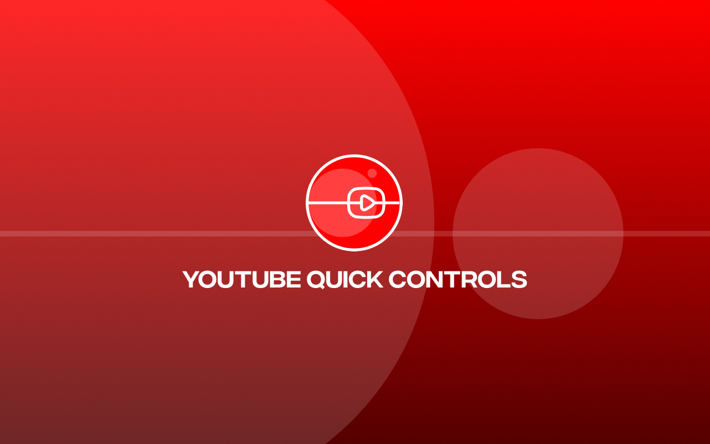

# [YouTube Quick Controls](https://chromewebstore.google.com/detail/youtube-quick-controls/hcbpfgoejhnhmdhkbnkeofhfmfmjfnjg)

## 🚀 What is YouTube Quick Controls?

A **powerful Chrome extension** that revolutionizes your YouTube viewing experience by adding instant quality and speed controls directly to every video. Skip the native settings menu and control your viewing with **one click** or **custom keyboard shortcuts**!

> **Why YouTube Quick Controls?** YouTube's default quality and speed controls are buried in menus and require multiple clicks. This extension puts them right where you need them - instantly accessible above every video.

## ✨ Key Features

### 🎯 **Instant Video Quality Control**

- **One-click access** to all available qualities (144p to 8K+)
- **Auto quality detection** - only shows qualities available for current video
- **Smart positioning** - controls appear above video title for easy access

### ⚡ **Extended Speed Control**

- **12 speed options**: 0.25x, 0.5x, 0.75x, 1x, 1.25x, 1.5x, 1.75x, 2x, 2.5x, 3x, 3.5x, 4x
- **Goes beyond YouTube's 2x limit** for power users
- **Perfect for** tutorials, lectures, and content consumption

### ⌨️ **Fully Customizable Keyboard Shortcuts**

- **Quality shortcuts**: Alt + 0 (Auto), Alt + 1-9 (144p-8K)
- **Speed shortcuts**: Shift + \` / 1-9 / 0 / - (0.25x-4x)
- **Custom mapping**: Change any shortcut to your preference
- **Conflict-free**: Only works on YouTube, won't interfere with other sites

### 🎨 **Modern, Clean Design**

- **Seamlessly integrated** with YouTube's interface
- **Dark theme** that matches YouTube's design language
- **Responsive layout** adapts to all screen sizes
- **Non-intrusive** - appears only when needed

### ⚙️ **Smart Customization**

- **Toggle controls**: Enable/disable quality or speed controls independently
- **Ultra-modern popup**: Sleek settings interface with animations
- **Settings sync**: Preferences saved across browser sessions
- **Live updates**: Changes apply instantly without page refresh

## 🚀 Installation

### 📦 From Chrome Web Store (Recommended)

1. Visit the [Chrome Web Store page](https://chromewebstore.google.com/detail/)
2. Click **"Add to Chrome"**
3. Confirm by clicking **"Add Extension"**
4. The extension icon will appear in your toolbar
5. Visit any YouTube video to see the controls!

### 🛠️ Manual Installation (Developer Mode)

Clone the repository
git clone https://github.com/harsh98trivedi/YouTube-Quick-Controls.git

Or download the ZIP file and extract it

1. Open Chrome and navigate to `chrome://extensions/`
2. Enable **"Developer mode"** in the top right
3. Click **"Load unpacked"** and select the extension folder
4. The extension will be installed and ready to use!

## 📖 How to Use

### 🎬 Basic Usage

1. **Navigate** to any YouTube video
2. **Look for controls** positioned above the video title
3. **Click quality buttons** (Auto, 720p, 1080p, etc.) to change video quality
4. **Click speed buttons** (0.25x, Normal, 2x, etc.) to change playback speed
5. **Active selections** are highlighted with visual feedback

### ⌨️ Keyboard Shortcuts

#### Quality Control

| Shortcut  | Quality | Description                   |
| --------- | ------- | ----------------------------- |
| `Alt + 0` | Auto    | YouTube's automatic selection |
| `Alt + 1` | 144p    | Lowest quality                |
| `Alt + 2` | 240p    | Low quality                   |
| `Alt + 3` | 360p    | Standard quality              |
| `Alt + 4` | 480p    | Enhanced quality              |
| `Alt + 5` | 720p    | HD quality                    |
| `Alt + 6` | 1080p   | Full HD                       |
| `Alt + 7` | 1440p   | 2K quality                    |
| `Alt + 8` | 2160p   | 4K quality                    |
| `Alt + 9` | 4320p   | 8K quality                    |

#### Speed Control

| Shortcut     | Speed | Use Case             |
| ------------ | ----- | -------------------- |
| `Shift + \`` | 0.25x | Slow motion analysis |
| `Shift + 1`  | 0.5x  | Detailed learning    |
| `Shift + 2`  | 0.75x | Careful listening    |
| `Shift + 3`  | 1x    | Normal speed         |
| `Shift + 4`  | 1.25x | Slightly faster      |
| `Shift + 5`  | 1.5x  | Efficient learning   |
| `Shift + 6`  | 1.75x | Quick consumption    |
| `Shift + 7`  | 2x    | Rapid playback       |
| `Shift + 8`  | 2.5x  | Power browsing       |
| `Shift + 9`  | 3x    | Ultra-fast scanning  |
| `Shift + 0`  | 3.5x  | Extreme speed        |
| `Shift + -`  | 4x    | Maximum speed        |

### ⚙️ Customization

#### Settings Access

- **Click the extension icon** in Chrome's toolbar
- **Modern popup interface** with toggle switches
- **Customize shortcuts**: Click any shortcut to record new key combination
- **Reset options**: Restore defaults or clear all shortcuts

#### Available Options

- ✅ **Quality Controls**: Enable/disable quality buttons and shortcuts
- ✅ **Speed Controls**: Enable/disable speed buttons and shortcuts
- 🎹 **Custom Shortcuts**: Personalize every keyboard shortcut
- 🔄 **Real-time Sync**: Settings apply immediately across all tabs

## 🛠️ Technical Specifications

### Browser Compatibility

- **Chrome**: Version 88+ (Manifest V3)
- **Chromium-based**: Edge, Brave, Opera, Vivaldi
- **Architecture**: Modern web extension standards

### Permissions Required

| Permission  | Usage                 | Why Needed             |
| ----------- | --------------------- | ---------------------- |
| `storage`   | Save user preferences | Remember your settings |
| `activeTab` | Access YouTube pages  | Add controls to videos |

### Performance

- **Lightweight**: Minimal resource usage
- **Fast loading**: Controls appear instantly
- **Efficient**: Uses YouTube's native APIs when possible
- **Reliable**: Multiple fallback methods for quality detection

## 🔧 Development

### Prerequisites

- Chrome Browser with Developer Mode
- Basic knowledge of JavaScript, HTML, CSS

#### 🎯 Quality Detection System

- **YouTube Player API**: Primary method for quality detection
- **DOM Inspection**: Fallback for reliability
- **Smart Filtering**: Only shows available qualities
- **8K Support**: Handles all resolution formats including future standards

#### ⚡ Speed Control Engine

- **Direct API**: Uses YouTube's native playback rate control
- **Video Element Fallback**: Ensures compatibility across updates
- **Extended Range**: Beyond YouTube's default 0.25x-2x limitation
- **Precise Control**: Accurate speed changes with visual feedback

#### 🎨 UI Integration

- **Native Styling**: Matches YouTube's design system
- **Responsive Design**: Adapts to all screen sizes and modes
- **Accessibility**: Proper ARIA labels and keyboard navigation
- **Performance**: Minimal DOM impact with efficient rendering

## 🤝 Contributing

We welcome contributions from the community! Here's how you can help:

### 🐛 Bug Reports

Found a bug? Please create a detailed issue:

- **Steps to reproduce** the problem
- **Expected vs actual** behavior
- **Browser version** and environment
- **Screenshots** if applicable

### 🔧 Pull Requests

Ready to contribute code?

1. **Fork** the repository
2. **Create** a feature branch (`git checkout -b feature/amazing-feature`)
3. **Follow** our coding standards
4. **Test** thoroughly on multiple videos
5. **Commit** with clear messages (`git commit -m 'Add amazing feature'`)
6. **Push** to your branch (`git push origin feature/amazing-feature`)
7. **Open** a Pull Request with detailed description

### Development Guidelines

- **Code Style**: Follow existing patterns and formatting
- **Testing**: Verify on various YouTube video types and qualities
- **Documentation**: Update README for new features
- **Performance**: Ensure changes don't impact loading speed
- **Compatibility**: Test across different browser versions

## 📊 Analytics & Privacy

### What We Track

- **Extension usage**: Install/uninstall statistics (anonymous)
- **Error reporting**: Crash logs for debugging (no personal data)
- **Feature usage**: Which features are most popular (aggregated)

### What We DON'T Track

- ❌ **Personal information**: No names, emails, or accounts
- ❌ **Browsing history**: No tracking of visited pages
- ❌ **Video content**: No logging of watched videos
- ❌ **Search queries**: No monitoring of YouTube searches

### Privacy Commitment

Your privacy is paramount. This extension:

- **Works locally**: All functionality runs in your browser
- **No external servers**: No data transmission to third parties
- **Minimal permissions**: Only requests necessary browser access
- **Open source**: Code is publicly auditable

## 📈 Changelog

### Version 1.0.0 (Latest)

- ✨ **Initial release** with full feature set
- 🎯 **Quality controls** for all resolutions up to 8K
- ⚡ **Speed controls** from 0.25x to 4x
- ⌨️ **Customizable keyboard shortcuts**
- 🎨 **Modern popup interface**
- ⚙️ **Flexible settings system**

## 💬 Support & Feedback

### Get Help

- 📚 **Documentation**: Check this [README](https://github.com/harsh98trivedi/YouTube-Quick-Controls/blob/master/README.md) first
- 🐛 **Bug Reports**: [Create an issue](https://github.com/harsh98trivedi/YouTube-Quick-Controls/issues/new?template=bug_report.md)

### Contact

- 🌐 **Website**: [harsh98trivedi.github.io](https://harsh98trivedi.github.io)
- 📧 **Email**: hi@harshtrivedi.in
- 🐙 **GitHub**: [@harsh98trivedi](https://github.com/harsh98trivedi)
- 🐦 **Twitter**: [@harsh98trivedi](https://twitter.com/harsh98trivedi)

## 📄 License

This project is licensed under the **The Unlicense license** - see the [LICENSE](LICENSE) file for complete details.

---

  
  **Made with ❤️ by [Harsh Trivedi](https://harsh98trivedi.github.io/) for YouTube Power Users**
  
  *Enhance your YouTube experience with lightning-fast video controls*
  
  ⭐ **Star this repo** if you found it helpful!
  
  
  
  

