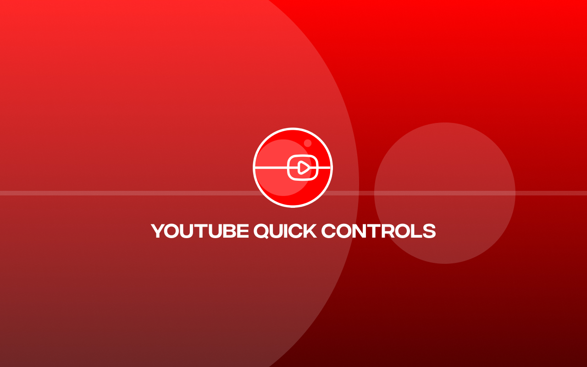

# [YouTube Quick Controls](https://chromewebstore.google.com/detail/youtube-quick-controls/hcbpfgoejhnhmdhkbnkeofhfmfmjfnjg)

[](https://chromewebstore.google.com/detail/youtube-quick-controls/hcbpfgoejhnhmdhkbnkeofhfmfmjfnjg)

## 🚀 What is YouTube Quick Controls?

A **powerful Chrome extension** that revolutionizes your YouTube viewing experience by adding instant quality, speed, and media controls directly to every video page. Skip the native settings menu and control your viewing with **one click** or **custom keyboard shortcuts**!

> **Why YouTube Quick Controls?** YouTube's default controls are buried in menus. This extension puts everything you need right above the video title — instantly accessible with a single click.

---

## ✨ Key Features

### 🎯 Instant Video Quality Control

- **One-click access** to all available qualities (Auto, 144p → 8K+)
- **1080p Premium detection** — shown with a distinct gold pill when available
- **Smart quality detection** — polls YouTube's API until the full quality list is loaded
- **Collapsible row** — click the **Quality ◀** label to hide/show the quality buttons, keeping the UI clean

### ⚡ Extended Speed Control

- **12 speed presets**: 0.25x, 0.5x, 0.75x, Normal, 1.25x, 1.5x, 1.75x, 2x, 2.5x, 3x, 3.5x, 4x
- **Goes beyond YouTube's 2x default limit**
- **Collapsible row** — click the **Speed ◀** label to hide/show speed buttons
- Both rows collapse **horizontally to the left**, keeping the rightmost label always visible

### 🎛️ Media Tools

A dedicated row of utility tools below the quality buttons:

| Tool | Description |
|---|---|
| 🔊 **Volume** | Hover to reveal a smooth range slider. Click the pill to toggle mute/unmute (restores previous volume). Muted state shows a distinct red dashed border. |
| 📝 **CC** | Toggle closed captions on/off |
| 📷 **Frame** | Capture and download the current video frame as a PNG |
| 🔁 **Loop** | Toggle video looping (button lights up red when active) |
| 🔗 **Time Link** | Copy a timestamped URL of the video at the current playback position |
| 🔀 **Copy URL** | Copy the clean video URL with no timestamp or extra parameters |
| `<>` **Embed** | Copy the HTML `<iframe>` embed code |
| 🎵 **Audio Track** | Switch between available audio tracks (only visible when multiple tracks exist) |

### ⌨️ Fully Customizable Keyboard Shortcuts

- **Quality shortcuts**: `Alt + 0` (Auto), `Alt + 1–9` (144p → 8K)
- **Speed shortcuts**: `Shift + `` / 1–9 / 0 / -` (0.25x → 4x)
- **Custom mapping**: Change any shortcut to your preference via the popup
- **Conflict-free**: Only active on YouTube, won't interfere with other sites

### 🎨 Modern, Premium Design

- **Compact pill-style buttons** matching YouTube's native chip design language
- **Collapsible sections** — Quality and Speed rows slide away horizontally with smooth animations
- **Inline SVG icons** (Lucide-style) for all tool buttons — perfectly aligned with text
- **Hover effects**: subtle lift (`translateY`), glow shadow, and border accent on all controls
- **1080p Premium** shown with a gold gradient pill, distinct from regular 1080p
- **Volume widget**: hover-reveal slider panel appears to the left of the pill with a 350ms grace period so you can reach it comfortably
- **Dark theme ready** — fully respects YouTube's dark mode using native CSS variables

### ⚙️ Smart Customization

- **Toggle sections independently**: Quality, Speed, and Media Tools can each be enabled/disabled from the popup
- **Settings sync**: Preferences saved with `chrome.storage.sync` across sessions and devices
- **Live updates**: Setting changes apply immediately without page refresh

---

## 🚀 Installation

### 📦 From Chrome Web Store (Recommended)

1. Visit the [Chrome Web Store page](https://chromewebstore.google.com/detail/youtube-quick-controls/hcbpfgoejhnhmdhkbnkeofhfmfmjfnjg)
2. Click **"Add to Chrome"**
3. Confirm by clicking **"Add Extension"**
4. Visit any YouTube video to see the controls!

### 🛠️ Manual Installation (Developer Mode)

```bash
git clone https://github.com/harsh98trivedi/YouTube-Quick-Controls.git
```

Or download the ZIP and extract it, then:

1. Open Chrome → `chrome://extensions/`
2. Enable **"Developer mode"** (top right)
3. Click **"Load unpacked"** → select the extension folder
4. Visit any YouTube video — controls appear above the title!

---

## 📖 How to Use

### 🎬 Basic Usage

1. Navigate to any YouTube video (`youtube.com/watch?v=...`)
2. Look for the control rows **above the video title**
3. **Quality row** (top): Click any quality pill to switch resolution instantly
4. **Media Tools row** (middle): Use volume, CC, screenshot, loop, and copy tools
5. **Speed row** (bottom): Click any speed pill to change playback rate
6. **Collapse rows**: Click the **Quality ◀** or **Speed ◀** label on the right to hide/show that row

### 🔊 Volume Control

- **Hover** over the volume pill → a smooth slider appears to the **left**
- **Drag** to set any volume level (snaps every 5%)
- **Click** the pill to toggle mute — clicking again **restores** the previous volume level
- When muted: pill shows a **red dashed border** and italic "Muted" label

### ⌨️ Keyboard Shortcuts

#### Quality Control

| Shortcut  | Quality | Description                   |
| --------- | ------- | ----------------------------- |
| `Alt + 0` | Auto    | YouTube's automatic selection |
| `Alt + 1` | 144p    | Lowest quality                |
| `Alt + 2` | 240p    | Low quality                   |
| `Alt + 3` | 360p    | Standard quality              |
| `Alt + 4` | 480p    | Enhanced quality              |
| `Alt + 5` | 720p    | HD quality                    |
| `Alt + 6` | 1080p   | Full HD                       |
| `Alt + 7` | 1440p   | 2K quality                    |
| `Alt + 8` | 2160p   | 4K quality                    |
| `Alt + 9` | 4320p   | 8K quality                    |

#### Speed Control

| Shortcut     | Speed  | Use Case             |
| ------------ | ------ | -------------------- |
| `Shift + \`` | 0.25x  | Slow motion analysis |
| `Shift + 1`  | 0.5x   | Detailed learning    |
| `Shift + 2`  | 0.75x  | Careful listening    |
| `Shift + 3`  | 1x     | Normal speed         |
| `Shift + 4`  | 1.25x  | Slightly faster      |
| `Shift + 5`  | 1.5x   | Efficient learning   |
| `Shift + 6`  | 1.75x  | Quick consumption    |
| `Shift + 7`  | 2x     | Rapid playback       |
| `Shift + 8`  | 2.5x   | Power browsing       |
| `Shift + 9`  | 3x     | Ultra-fast scanning  |
| `Shift + 0`  | 3.5x   | Extreme speed        |
| `Shift + -`  | 4x     | Maximum speed        |

### ⚙️ Popup Settings

- Click the extension icon in Chrome's toolbar
- Toggle **Quality Controls**, **Speed Controls**, or **Media Tools** with switches
- Customize keyboard shortcuts by clicking any shortcut and pressing your desired key combo
- Reset to defaults or clear all shortcuts at any time

---

## 🛠️ Technical Specifications

### Browser Compatibility

- **Chrome**: Version 88+ (Manifest V3)
- **Chromium-based**: Edge, Brave, Opera, Vivaldi

### Permissions Required

| Permission        | Usage                                  | Why Needed                          |
| ----------------- | -------------------------------------- | ----------------------------------- |
| `storage`         | Save user preferences                  | Remember settings across sessions   |
| `activeTab`       | Access YouTube watch pages             | Inject controls above video title   |
| `clipboardWrite`  | Copy URL / Time Link / Embed code      | Write to clipboard on button click  |

### Performance

- **Lightweight**: Minimal DOM footprint, no heavy frameworks
- **Fast startup**: Controls render immediately on page load
- **Efficient polling**: Quality detection stops as soon as the full list is available
- **Multiple fallbacks**: DOM inspection used if YouTube API isn't ready

### Quality Detection System

- **YouTube Player API** (`getAvailableQualityLevels`): primary method
- **Polling loop** (200ms interval): waits until the complete quality list is available before stopping
- **DOM fallback**: inspects the settings menu if API is unavailable
- **Sorted output**: Auto → 144p → … → 1080p → 1080p Premium → 1440p → 4K → 8K

---

## 🤝 Contributing

### 🐛 Bug Reports

Found a bug? Please create a detailed issue:

- Steps to reproduce
- Expected vs actual behaviour
- Browser version and OS
- Screenshots if applicable

### 🔧 Pull Requests

1. **Fork** the repository
2. **Create** a feature branch (`git checkout -b feature/amazing-feature`)
3. **Test** on multiple YouTube videos and quality levels
4. **Commit** with clear messages (`git commit -m 'Add amazing feature'`)
5. **Open** a Pull Request with a detailed description

---

## 📄 Privacy

This extension operates **entirely locally** in your browser:

- ❌ No personal data collected
- ❌ No browsing or watch history tracked
- ❌ No external servers or analytics
- ✅ Settings stored locally via `chrome.storage.sync`
- ✅ Clipboard access only used on explicit button click

See [PRIVACY-POLICY.md](PRIVACY-POLICY.md) for full details.

---

## 📈 Changelog

### Version 1.1.0

- 🎛️ **Media Tools row** — Volume slider, CC, Screenshot, Loop, Copy URL, Time Link, Embed, Audio Track
- 🔊 **Premium Volume Widget** — hover-reveal slider, mute toggle with restore, distinct muted styling
- 📐 **Collapsible Quality & Speed rows** — horizontal slide animation, label stays visible on the right
- 🎨 **Inline SVG icons** — Lucide-style icons replace emojis for pixel-perfect alignment
- 🏆 **1080p Premium button** — distinct gold gradient pill
- ✅ **Reliable quality detection** — polling waits for full quality list before stopping
- ⚙️ **Media Tools toggle** added to extension popup

### Version 1.0.0

- ✨ Initial release with quality and speed controls
- ⌨️ Customizable keyboard shortcuts
- 🎨 Modern popup interface

---

<div align="center">

**Made with ❤️ by [Harsh Trivedi](https://harsh98trivedi.github.io/) for YouTube Power Users**

*Enhance your YouTube experience with lightning-fast video controls*

⭐ **Star this repo** if you found it helpful!

[](https://github.com/harsh98trivedi/YouTube-Quick-Controls/stargazers)
[](https://github.com/harsh98trivedi/YouTube-Quick-Controls/network)

</div>
